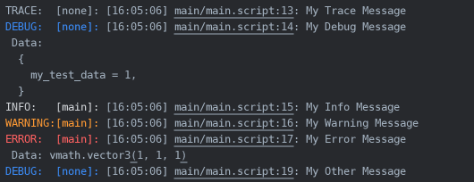

# SQUID 🦑

**Squid** is a standalone injectable system for saveable logging of user logs, errors and crashes for Defold.

License: MIT

Copyright 2024-2025 Paweł Jarosz

---

## Defold dependency:

You can add Squid as a dependency to Defold. Open your `game.project` file and add the following link as an entry in the `Dependencies` under the `Project` section. Current version is 1.0: 

`https://github.com/paweljarosz/squid/archive/refs/tags/1.0.zip`

Squid uses also immutable configuration, so add dependency to newest Immutable too. Current is 1.1:

`https://github.com/paweljarosz/lua-immutable/archive/refs/tags/v1.1.zip`

## Usage:

Squid offers simple static API, check examples:

```lua
-- If squid is initialized with init() it will handle errors and crashes automatically too
squid.init()

-- Define new tag strings and enable/disable them:
squid.set_allowed("main", true)

-- Use static logging functions with or without optional non-string data and/or tag string:
squid.trace("My Trace Message")								-- no data and no tag, uses default tag ("none")
squid.debug("My Debug Message  ", { my_test_data = 1 })		-- with optional non-string data (default tag used)
squid.info( "My Info Message   ", "main")					-- with string data only (used as tag too)
squid.warn( "My Warning Message", "Hello World", "main")	-- with string data and tag ("main" tag is used as tag here)
squid.error("My Error Message  ", vmath.vector3(1), "main")	-- with non-string data and tag

-- Or generic logging function with own logging level:
squid.log("My Other Message", squid.DEBUG)

-- You can explicitly save any unsaved buffered logs to a file at any time:
--(logs are saved automatically anyway, in batch, every X logs if configured in game.project)
squid.save_logs()

-- If squid.final() is called (in final() preferably) it checks for crash dumps and saves all unsaved buffered logs
squid.final()
```

## Instancing

Squid can be conveniently used as internal logger module for various other Defold modules, e.g.:
* [Pigeon](https://github.com/paweljarosz/pigeon) by Paweł Jarosz
* [Defold Saver](https://github.com/Insality/defold-saver) by Insality
* [Defold Event](https://github.com/Insality/defold-event) by Insality

```lua
-- Create new instance with optional tag assigned (`none` by default) initially allowed or not:
local is_allowed = true
self.player_logger = squid.new("player", is_allowed)

-- Use all API function with the created instance:
self.player_logger:info("Logger with 'player' tag")
```

Above prints in console and writes to a log file (tables are always pretty printed):
```lua
TRACE:  [none]: [16:05:06] main/main.script:13: My Trace Message
DEBUG:  [none]: [16:05:06] main/main.script:14: My Debug Message
 Data:
  {
    my_test_data = 1,
  }
INFO:   [main]: [16:05:06] main/main.script:15: My Info Message
WARNING:[main]: [16:05:06] main/main.script:16: My Warning Message
ERROR:  [main]: [16:05:06] main/main.script:17: My Error Message
 Data: vmath.vector3(1, 1, 1)
DEBUG:  [none]: [16:05:06] main/main.script:19: My Other Message
```

Additionally, the different log level messages are *colored* in Defold console:



## Configuration

Squid can be configured in Defold's `game.project` file. Add squid configuration at the end of the file:

```
[squid]
app_catalog = squid_app_catalog
log_file_name = squid_log_file
log_file_extension = log
is_enabled = 1
is_enabled_in_release = 1
is_printing = 1
is_saving = 1
is_adding_timestamp = 1
is_using_allowlist = 1
days_to_delete_logs = 7
min_log_level = 1
unsaved_logs_buffer = 30
max_data_length = 1000
max_data_depth = 5
```

| Entry | Default | Type | Description |
|-|-|-|-|
| **app_catalog** | `squid_app_catalog` | *[string]* || name of the catalog where file with logs is. Parent directory is %appdata% for Windows, ~/config/ for Linux, for HTML5 it is a prefix for cache. |
| **log_file_name** | `squid_log_file` | *[string]* |name of the file where logs are saved. |
| **log_file_extension** | `log` | *[string]* |extension for the file where logs are saved. Full file name is `log_file_name.log_file_extension`. |
| **is_enabled** | 1 | *[0/1]* |- logging is disabled/enabled |
| **is_enabled_in_release** | 1 | *[0/1]* |- logging is disabled/enabled in release |
| **is_printing** | 1 | *[0/1]* |- logs printing to console is disabled/enabled |
| **is_saving** | 1 | *[0/1]* |- logs saving to file is disabled/enabled |
| **is_adding_timestamp** | 1 | *[0/1]* |- will/won't add a timestamp as a suffix to log file name in format `_YYYY-MM-DD_hh_mm` |
| **is_using_allowlist** | 1 | *[0/1]* |- will/won't check tags against their state in allowlist |
| **days_to_delete_logs** | 7 | *[integer]* | amount of days after which old logs are deleted from app_catalog, e.g if set to 7, logs older than 7 days will be deleted on next `squid.init()` call, 0 means previous logs will be always deleted |
| **min_log_level** | 1 | *[integer]* | minimum logging level, where: 1 = TRACE, 2 = DEBUG, 3 = INFO, 4 = WARNING, 5 = ERROR |
| **unsaved_logs_buffer** | 30 | *[integer]* | amount of logs that are buffered internally before saving automatically in batch to a log file, e.g. if set to 30, every 30 logs the automatic saving will be invoked and buffered logs will be cleared from memory |
| **max_data_length** | 1000 | *[integer]* | maximum length of a data string |
| **max_data_depth** | 5 | *[integer]* | maximum depth of a data table |

*[0/1]* will be replaced with boolean checkboxes when [it will be possible in Defold with this issue solved](https://github.com/defold/defold/issues/9981).

## Thanks

Squid is heavily inspired by [Log](https://github.com/subsoap/log) and [Err](https://github.com/subsoap/err) by Subsoap and [Defold Log](https://github.com/Insality/defold-log) by Insality and uses and iterates over some of their solutions. Squid tries to be compatible with both APIs for easier replacements.

If you like this module, you can show appreciation by supporting them. Insality is running [Github Sponsors](https://github.com/sponsors/insality), Ko-Fi, etc and [Subsoap is creating awesome games](https://www.subsoap.com/).

You can also support me here via [Github Sponsors text](https://github.com/sponsors/paweljarosz), [Ko-Fi](https://ko-fi.com/witchcrafter) or [Patreon](https://www.patreon.com/witchcrafter_rpg) ;)

## Changelog

#### 1.0
First public version release.


## License

MIT

Copyright 2024-2025 Paweł Jarosz

Permission is hereby granted, free of charge, to any person obtaining a copy of this software and associated documentation files (the “Software”), to deal in the Software without restriction, including without limitation the rights to use, copy, modify, merge, publish, distribute, sublicense, and/or sell copies of the Software, and to permit persons to whom the Software is furnished to do so, subject to the following conditions:

The above copyright notice and this permission notice shall be included in all copies or substantial portions of the Software.

THE SOFTWARE IS PROVIDED “AS IS”, WITHOUT WARRANTY OF ANY KIND, EXPRESS OR IMPLIED, INCLUDING BUT NOT LIMITED TO THE WARRANTIES OF MERCHANTABILITY, FITNESS FOR A PARTICULAR PURPOSE AND NONINFRINGEMENT. IN NO EVENT SHALL THE AUTHORS OR COPYRIGHT HOLDERS BE LIABLE FOR ANY CLAIM, DAMAGES OR OTHER LIABILITY, WHETHER IN AN ACTION OF CONTRACT, TORT OR OTHERWISE, ARISING FROM, OUT OF OR IN CONNECTION WITH THE SOFTWARE OR THE USE OR OTHER DEALINGS IN THE SOFTWARE.